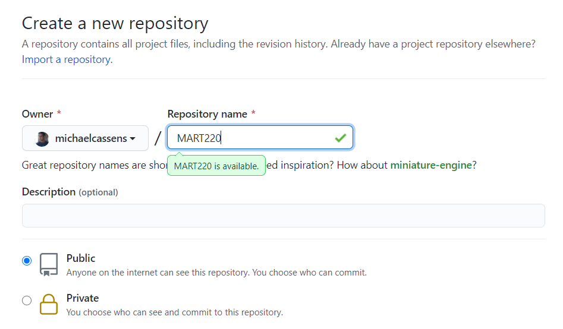
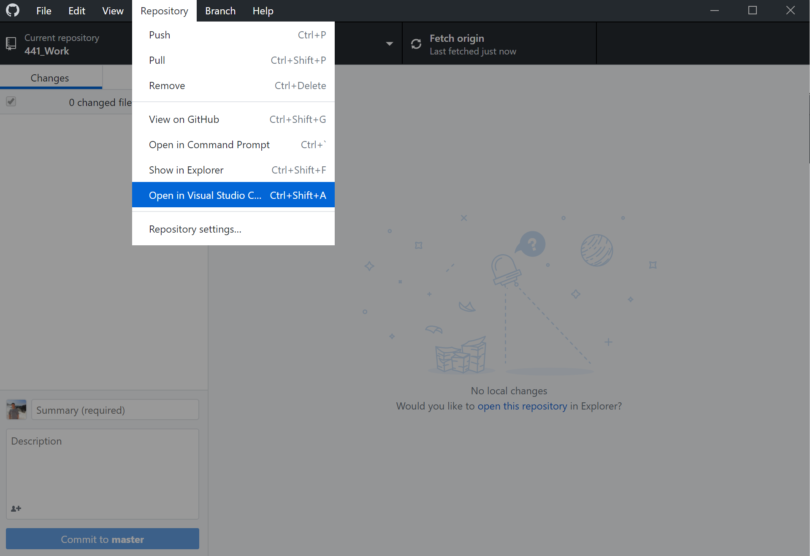

## Create a New Git Repository for This Course

Before we dive into the assignment for the week, I want to walk you through creating a new Git repository for use in this course. We will also turn this repository "on", as a GitHub-Pages site.

First, we will create a new repo directly on GitHub.com. We will then turn it on as a GH-Pages site. Finally, we will "clone" it to our local machine, add some necessary files, and then push those back to the remote host on GitHub.com.

## 1. Create a New Repo on GitHub.com

1. Go to [GitHub.com](https://github.com)
2. If you are not signed in, sign in to your GitHub account
3. Find the green "New repository" button and press it.

4. Give your repository a great name, like "_441_".
    - Optionally, give this repo a description, like "_Homework repo for UMontana Media Arts, Web Tech (MART441) course._".
5. Keep this as a "Public" repo.
6. Select the "Initialize this repository with a README" box.
7. Finally press the "Create Repository" button.

 

Your browser will now show you the brand new repository!

## 2. Clone Your New Repo

1. To clone your repository, go back to the main page of the new repo.
2. Select the "Clone or Download" button on this main page.
3. If you are using the GitHub Desktop app, then you simply need to press the "Open in Desktop" button. If instead you are using another app, copy the git URL that pops up.

#### For GitHub Desktop Users

1. After pressing "Open in Desktop" the browser should ask permission to "allow this page to open GitHub Desktop.app?"
2. Select "Allow"
3. When GitHub Desktop.app open the "Clone a Repository" window, select the "Choose..." button to navigate to a location on your system where you want this repository saved. (This is just picking a "parent" directory, not naming the directory itself.)
4. GitHub Desktop.app will suggest a directory name that is based on the repo name. Feel free to change that in the "Local Path" line to something else.
5. Finally, click "Clone".

## 3. Open The Repo Directory in your Text Editor

Finally, you should open the new local copy of the repo directory in your text editor. If you are using GitHub Desktop.app, you can select the "Open in Atom" or "Open in Visual Studio Code" option from the "Repository" dropdown menu (depending on the text editor you have installed and setup with GitHub Desktop.app)

## 4. Commit Changes and Push to GitHub.com

1. Back in GitHub Desktop.app or your Git app / CLI, stage & commit your changes to the repo.

2. Next, Push your commits to the remote repository on GitHub.com, thereby sync-ing the remote and local versions of the repo.

## 5. Verify Sync on GitHub.com

1. In your browser, navigate back to your repository on github.com.
2. You should now see the updated README.md being displayed, as well as the existence of the 'index.html' file.

